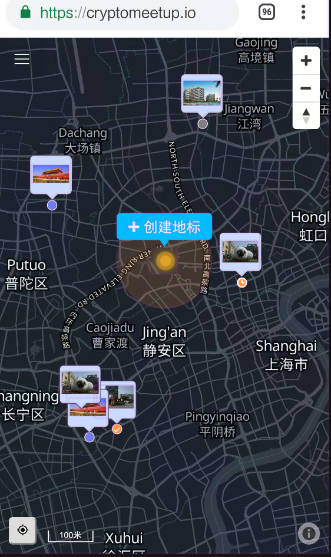
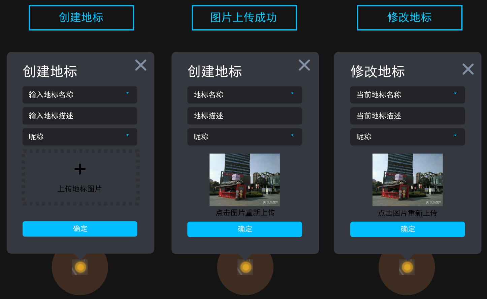
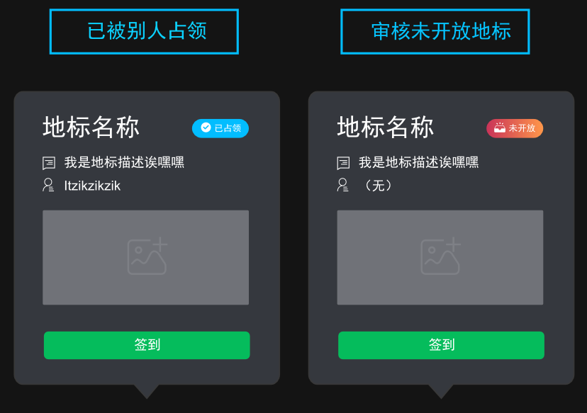
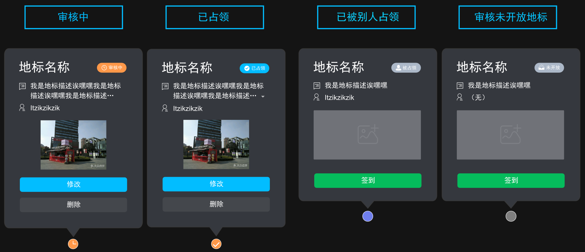
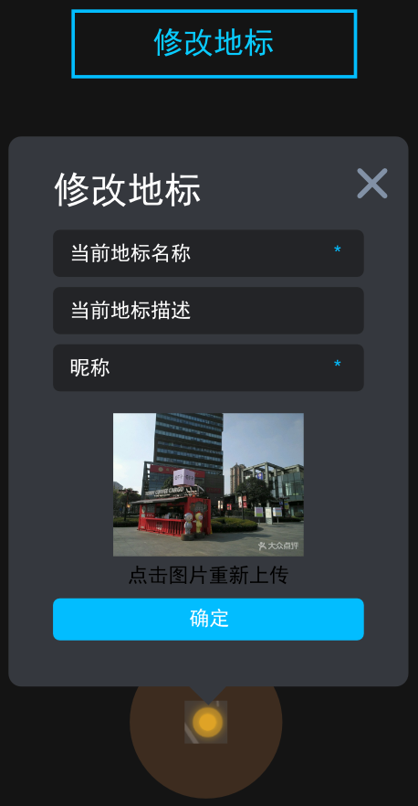

# 地标功能前端详细需求设计
---

## 1. 用户打开币聚后
这是进入页面时候看到的画面：

*  获取GPS后，会自动定位到当前位置，并且将用户的位置居中显示在屏幕上，并且显示出当前位置的签到范围。
    * 在用户当前位置渲染代表用户所在地的UI（已经有黄色的圆形UI）
    * 以用户当前位置为中心，渲染一个半径为50米签到范围的半透明圆形签到范围。
    * 当用户缩放地图后，重新渲染签到范围覆盖的范围。
*  当前用户定位坐标与距离最近的地标间隔大于10米时，在用户当前位置上方显示“创建地标”按钮。
*  默认显示其500米以内任何用户创建的处于“已占领”状态的地标。
*  默认显示其500米以内任何用户创建的处于“未开放”状态的地标。
*  默认载入地图时缩放显示比例尺单位对应为500米。
*  默认显示当前登录**用户创建的所有**处于“审核中”和“已占领”状态的所有地标。
*  地标完整显示方式都是缩略图气泡+标记点。
    * 缩略图气泡显示规则：
        * 只有当地图比例尺显示精度达到100米的时候，才开始显示缩略图气泡，气泡中展示当前地标的缩略图片
        * 缩略图紧密显示在标记点的上方
        * 当缩略图气泡出现遮挡情况时，默认地图中越靠近北极的气泡显示层级越高，越靠近左边的气泡显示层级越高。
        * 层级高的气泡会遮挡层级低的缩略图气泡。
    * 标记点显示规则：
        * 一共采用4种UI图标来区分标记点（见下图）
            * 未开放的地标--未开放状态（灰色圆点）
            * 别人发布的地标--被占领状态（蓝色圆点）
            * 当前登录用户发布的地标--审核中状态（橘色时钟圆点）
            * 当前登录用户发布的地标--已占领状态（橘色对勾圆点）
        * 标记点的显示层级低于缩略图气泡,因此气泡一定会遮挡住标记点。（见上图）  
  

---
## 2. 互动操作
### 2.1 地图操作
* 重新定位：点击“定位按钮”，重新定位用户位置，并且重新渲染周围地标内容。
* 缩放地图时：在“定位按钮”旁边加入比例尺显示。
### 2.2 创建地标

* 当用户点击“创建地标”按钮之后，会在用户当前位置显示出“创建地标”弹窗，并且将用户位置图标和地图在屏幕上保持水平居中，垂直居画面下方1/3处.
* 只有点击“创建地标”弹窗上的退出按钮才可以关闭弹窗界面
* 在“创建地标”弹窗中需要填写以下信息（\*号为必填）
    * 地标名称 \*
    * 地标描述
    * 点击上传地标图片 \*（固定尺寸的缩略图，点击可放大）
    * 昵称 \* （注：该昵称不跟随地标，跟随用户，即该用户所占领的所有地标，昵称均为一个，初始没有，默认显示为：“用户+随机八位字符串”，字符串为字母+数字）
* 填写完成后再次点击图片可以重新上传
* 点击“确定”按钮之后，弹出钱包签名请求，确认签名后上传内容，该地标进入审核状态，由后台人员进行审核。（审核流程~）
* 在审核过程中，会在该申请地标的位置生成一个只有“创建者”和“管理员”才可以看见的标记点和缩略图气泡

### 2.3 审核地标
* 地标审核状态一共有4种：
    * 审核中：用户提交后的状态，在管理员没有审核完成之前，用户都可以以远程的方式选中地标并且进行内容修改（查看上图中“审核中”“已占领”和“修改地标”中的设计）
    * 已占领：审核通过后的状态。
    * 已删除：
    * 未开放：后续可以开发用户主动释放地标，以及管理员删除用户占领的地标功能。（比如认定某个用户为恶意用户，管理员可清空他的资产。）
### 2.4 查看地标
* 显示和加载地标的规则：
    * 别的用户通过审核的地标，用户自己上传的地标，未开放的地标都会加载给当前用户。
    * 默认刚进入地图时加载当前用户周围500米内所有地标的“标记点”和“缩略图气泡”，同时加载当前已登录用户通过审核的所有地标。（如果用户还没有登录就不加载）
    * 当用户滑动地图时，动态加载屏幕视野内的地标“标记点”和“缩略图气泡"
    * 当用户缩放地图时，属于当前用户的地标会一直显示，不受到缩放的影响。
    * 当用户缩小地图时，不属于当前用户的地标会进行合并显示，显示为一个统计“数字UI”。当用户放大地图时候，这个数字UI会消失，并且加载当前一屏内的所有地标。（具体数值需要测试）
* 与地标交互的规则：
    * 点击“数字UI”后，会自动放大地图到刚好可以展开显示地标的程度
    * 点击地标的“标记点”上方的“缩略图气泡”可以弹出当前点击地标的详细信息（弹窗界面参照下图）
        * 如果是当前用户自己上传的地标，显示的信息有：
            * 地标名称
            * 占领者昵称
            * 地标描述
            * 地标状态：审核中（橘色）/已占领（蓝色）
            * 地标图片：点击图片可以弹出图片层，单独放大显示这张图
            * 修改按钮：点击后需要钱包签名确认身份，然后切换为修改地标浮窗（查看条目2.5）
            * 删除按钮：点击后需要钱包签名确认身份，然后删除当前地标
        * 如果是被别人占领的地标或是未开放的地标，显示的信息有：
            * 地标名称
            * 占领者昵称：未开放的地标显示“（无）”
            * 地标描述
            * 地标状态：被占领（灰色）/未开放（灰色）
            * 地标图片：点击图片可以弹出图片层，单独放大显示这张图
            * 签到按钮：点击后需要钱包签名确认身份，然后弹出“签到成功提示”
            * 被签到次数（功能和UI未设计）

 
### 2.5 修改地标
* 修改地标的操作步骤：
    * 用户点击自己创建的处于“审核中”和“已占领”状态的地标
    * 在弹出的浮窗中可以选“修改”或“删除”操作
    * 然后弹出请求使用钱包签名来验证身份
    * 切换当前浮窗为“修改地标浮窗”
        * 点击不同文本框修改：地标名称、地标描述、昵称。
        * 点击已有图片可以重新上传图片。
    * 操作修改完成后，点击确认上传。这一步应该无需钱包签名认证。

### 2.5 签到
* 用户只可以在处于“被占领”和“未开放”状态的地标上进行签到。
* 用户不可以在自己创建的地标上进行签到。
* 签到流程：
    * 当地标位置在当前用户的距离<=50米（签到范围）的时候，用户点击该地标缩略图气泡
    * 弹出当前地标的浮窗
    * 点击签到按钮
        * 如果当前距离地标大于50米，则弹出错误提示：“请靠近该地标后进行签到”
        * 如果当前距离满足签到范围，则进图下一步：
    * 请求钱包签名验证身份
    * 成功签到
* 签到统计：（暂时不用显示在地标界面上）
    * 统计每个地标上总计被签到次数
    * 统计每个地表上每个用户签到次数

---

---

下面是草稿

UI显示
* 已经被打卡几次
* ~~打卡/签到功能按钮~~
* 用户怎么知道地标审核未通过被删除
* 区分别人地标点、我的地标点，别人申请的未开放地标点，我申请的未开放地标点，活动地标点，
* 用户自定义地标图案，用户自定义地标查看权限（只给自己看/开放给所有人）
* 地标的聚合显示：当缩放地图时，非当前用户上传的地标如何进行聚合显示（提供切换按钮？）
* 图标说明：橘黄色/蓝色/红色点点的图示说明--可以放在感叹号里面
* ~~增加比例尺~~
* ~~~可不可以云修改地标，或者必须去到实地修改。~~
* 当同一个位置有用户地标正在审核，那别的用户可不可以创建地标？
* ~~什么样的情况下不可以创建地标（没有创建地标按钮）~~
* ~~什么样的极限情况下可以签到~~

功能
* ~~用户如何开始打卡签到功能~~
* 用户的地标管理功能（后续）
* 地标筛选：只显示：活动/别人公开的地标/我的私有地标（后续）/我的公开地标
* 自动签到功能
* 昵称的机制是什么？

感叹号：
* 请勿发布违法图片，否则无法审核通过
* 

用户操作行为提示：
* 我们将尽快审核，审核通过后就可以被别人看到