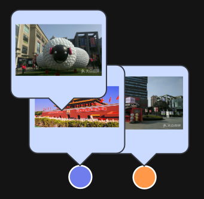
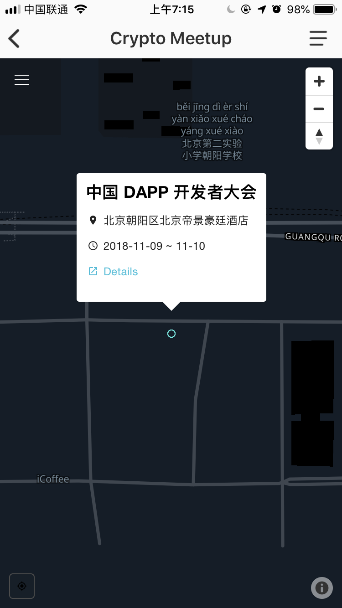

# 详细需求设计
---
还在完善，11月21号下午2点时候应该可以写完
## 1. 用户打开币聚后

* a) 会自动定位到当前位置，并且将用户的位置居中显示在屏幕上，并且显示出当前位置的签到范围。
    * 在用户单签位置渲染代表用户的UI（已经有）
    * 以用户当前位置为中心，渲染一个半径为50米签到范围的半透明圆形签到范围。
    * 当用户缩放地图后，重新渲染签到范围覆盖的范围。
* b)当用户可以创建地标的时候，在用户当前位置上
* c) 默认显示其500米以内任何用户创建的处于“已拥有”状态的地标
* d) 默认显示其500米以内任何用户创建的处于“未开放”状态的地标。
* d) 默认显示当前登录**用户创建的所有**处于“审核中”和“已拥有”状态的所有地标
* e) 当前用户定位坐标与距离最近的地标间隔大于10米时，在用户当前位置上方显示“创建地标”按钮
* d) 地标完整显示方式都是缩略图气泡+标记点。
    * 缩略图气泡显示规则：
        * 只有当地图比例尺显示精度达到100米的时候，才开始显示缩略图气泡，气泡中展示当前地标的缩略图片
        * 缩略图紧密显示在标记点的上方
        * 当缩略图气泡出现遮挡情况时，默认地图中越靠近北极的气泡显示层级越高，越靠近左边的气泡显示层级越高。层级高的气泡会遮挡层级低的气泡。

    * 标记点显示规则：
        * 一共采用4种UI图标来区分标记点
            * 未开放的地标：（灰色圆点）
            * 别人发布的地标：（蓝色圆点）
            * 当前登录用户发布的地标--审核中状态（橘色时钟圆点）
            * 当前登录用户发布的地标--已拥有状态（橘色对勾圆点）
        * 标记点的显示层级低于缩略图气泡,气泡一定会遮挡住标记点
            

---
## 2. 互动操作
* 点击地图界面上任意图标，都会弹出详情界面，并且将点击的图标水平居中，垂直居画面下方1/3处
### 创建和修改地标

#### 创建地标
* 当用户点击“创建地标”按钮之后，会显示出创建地标弹窗，需要填写以下信息（\*号为必填）
    * 地标名称 \*
    * 地标描述
    * 点击上传地标图片 \*（固定尺寸的缩略图，点击可放大）
    * 昵称 \* （注：该昵称不跟随地标，跟随用户，即该用户所拥有的所有地标，昵称均为一个，初始没有，默认显示为：“用户+随机八位字符串”，字符串为字母+数字）
* 填写完成后再次点击图片可以重新上传
* 点击“确定”按钮之后，上传内容，该地标进入审核状态，由后台人员进行审核。（审核流程~）
#### 审核
* 在审核过程中，会在该申请地标的位置生成一个只有“创建者”和“管理员”才可以看见的标记点和缩略图气泡
* 地标审核状态一共有三种：
    * 审核中：用户提交后的状态，在管理员没有审核完成之前，用户都可以以远程的方式选中地标并且进行内容修改（查看上图中“审核中”“已拥有”和“修改地标”中的设计）
    * 已拥有：审核通过后的状态。
    * 删除
    * 未开放：后续可以开发用户主动释放地标，以及管理员删除用户拥有的地标功能。（比如认定某个用户为恶意用户，管理员可清空他的资产。）
### 查看地标

1. 用户上传后，该地标进入审核状态，由后台人员审核通过后状态变为已拥有。（后台审核页面待定）

2. 地标状态一共分为三种：

3. 用户上传后，即在该点显示一个新的标识。点击弹出浮层显示详情（类似于dapp大会的显示。）

* 浮层显示的详情信息包括：地标名称，拥有者昵称，地标描述，地标状态（审核中，已拥有），地标照片（缩略图，点击可放大）

任意用户都可以上传地标。地标上传之后会进入审核状态，在审核过程中这个地标只有发布用户自己可以看到，在审核未完成之前，用户可以一直提交修改。---审核完成结果有3种状态：1.审核通过。2.审核不通过删除。3.审核不通过但不删除（未开放地标）。状态1的情况下，所有用户都可以看到这个地标点，任何人都可以来这个地标点打卡。状态2的情况下，所有用户都无法看到这个地标点。状态3的情况下，任何人都可以看到这个地标点（公共地标状态）---

前期简化设计，所有用户自己的各种状态的点都用同一个样式（橘黄色），别人所有状态的点都同一个样式（蓝色），所有未开放的地标点都使用同一个样式（红色）

UI显示
* 已经被打卡几次
* 打卡/签到功能按钮
* 用户怎么知道地标审核未通过被删除
* 别人地标点、我的地标点，别人申请的未开放地标点，我申请的未开放地标点，活动地标点，
* 用户自定义地标图案，用户自定义地标查看权限（只给自己看/开放给所有人）
* 地标的缩放聚合显示（切换按钮）
* 橘黄色/蓝色/红色点点的图示说明--可以放在感叹号里面
* 增加比例尺
* 可不可以云修改地标，或者必须去到实地修改。
* 当同一个位置有用户地标正在审核，那别的用户可不可以创建地标？
* ~~什么样的情况下不可以创建地标（没有创建地标按钮）~~
* 什么样的极限情况下可以签到

功能
* 用户如何开始打卡签到功能
* 用户的地标管理功能（后续）
* 地标筛选：只显示：活动/别人公开的地标/我的私有地标（后续）/我的公开地标
* 自动签到功能

感叹号：
* 请勿发布违法图片，否则无法审核通过
* 

用户操作行为提示：
* 我们将尽快审核，审核通过后就可以被别人看到